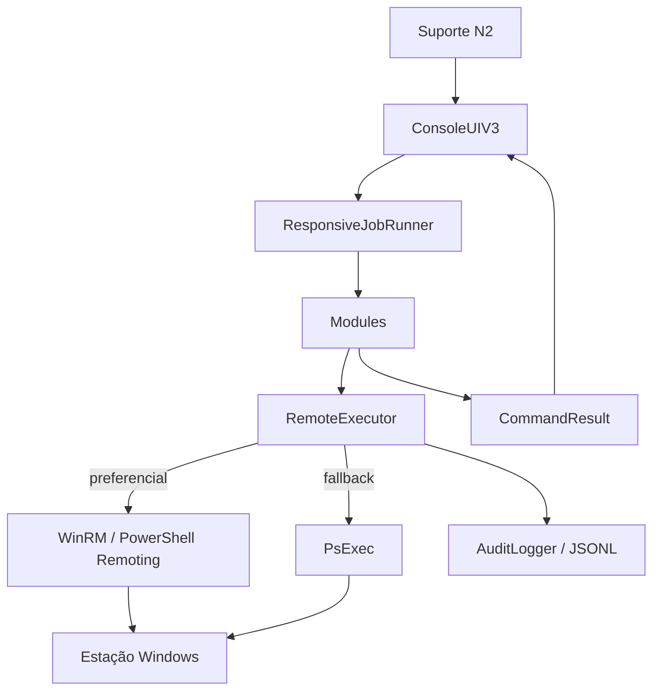

# Central N2 Workstation v5

> Versão atual: 5.0.0 — arquitetura Local → WinRM → PsExec, diagnóstico correlacionado, playbooks, histórico SQLite, GLPI API opcional, GUI e pipeline de release.

Consulte central_n2/docs/v5_complete.md e central_n2/CHANGELOG.md.

---

# Central N2 Workstation

Central de manutenção, diagnóstico e troubleshooting remoto para **estações de trabalho Windows**, desenvolvida para rotinas de suporte N2.

> **Status atual:** Workstation v3 responsiva  
> **Plataforma:** Windows 10/11 e Windows Server utilizado como estação administrativa  
> **Runtime:** Python 3.10+  
> **Transporte preferencial:** PowerShell Remoting / WinRM  
> **Fallback:** PsExec / Sysinternals

A Central N2 nasceu da evolução do projeto histórico `autoPsexec`. Os arquivos `main.py` e `novoPsexec.py` existentes na raiz são mantidos **somente como referência histórica**. A aplicação atual está em `central_n2/` e deve ser iniciada por `central_n2/main.py`.

---

## Objetivo

A Central N2 concentra em uma única interface operações recorrentes de suporte Windows que normalmente exigiriam alternância entre PowerShell, CMD, ferramentas administrativas, Event Viewer, Device Manager, Windows Update, Sysinternals e acesso remoto interativo.

O foco não é substituir ferramentas corporativas de gestão, EDR, MDM ou ITSM. O foco é reduzir o tempo de diagnóstico e intervenção do técnico N2, mantendo:

- execução remota padronizada;
- retorno visual durante operações longas;
- timeouts controlados;
- fallback de transporte;
- confirmação para ações de maior impacto;
- resultado estruturado;
- logging/auditoria local;
- módulos desacoplados;
- possibilidade de expansão sem transformar a aplicação em um script monolítico.

---

## Principais capacidades

### Saúde e compliance

- score de saúde da estação;
- CPU, RAM, disco e uptime;
- reboot pendente;
- serviços automáticos parados;
- status de Microsoft Defender e Firewall;
- status do GLPI Agent;
- baseline configurável de conformidade.

### Performance

- amostragem temporizada de CPU, memória, disco e rede;
- identificação de processos com maior consumo;
- visão de gargalos sem depender de uma fotografia instantânea do sistema.

### Reparo do Windows

- `sfc /scannow`;
- DISM `CheckHealth`, `ScanHealth` e `RestoreHealth`;
- análise e limpeza do Component Store;
- `chkdsk /scan`;
- verificação de consistência do repositório WMI.

### Hardware, drivers e dispositivos

- inventário de hardware;
- dispositivos com erro;
- drivers instalados e assinados;
- dispositivos USB;
- rescan de hardware;
- exportação de drivers;
- discos físicos e saúde exposta pelo Windows;
- informações de bateria quando disponíveis.

### Inicialização e tarefas

- programas/chaves de inicialização;
- serviços automáticos parados;
- tarefas agendadas;
- tarefas com falha;
- integração opcional com Autorunsc.

### Crashes e BSOD

- histórico de BugCheck;
- inventário de `Minidump` e `MEMORY.DMP`;
- eventos de crash de aplicações;
- captura opcional de dump com ProcDump.

### Segurança

- Microsoft Defender;
- ameaças recentes;
- Firewall;
- BitLocker;
- TPM;
- Secure Boot;
- RDP;
- SMBv1;
- UAC;
- certificados de máquina e vencimentos.

### Rede da estação

- interfaces;
- IP, gateway e DNS;
- DHCP;
- ARP;
- conexões TCP;
- flush DNS;
- renovação DHCP;
- reset Winsock/TCP-IP nas rotinas existentes;
- consulta de proxy WinHTTP/Internet Settings.

### Usuários e perfis

- sessões;
- administradores locais;
- perfis locais e tamanho;
- histórico recente de logons;
- ações de perfil disponíveis nos módulos existentes.

### Software e inventário

- software instalado;
- integração com Winget;
- catálogo homologado configurável;
- GLPI Agent;
- instalação/reparo e inventário GLPI conforme configuração do ambiente.

### Impressoras

- inventário;
- filas de impressão;
- reinício do Spooler;
- limpeza de fila com confirmação operacional adequada.

### Domínio e GPO

- domínio atual;
- secure channel;
- Domain Controller;
- status de horário;
- `gpresult`;
- `gpupdate`;
- reparo de secure channel quando autorizado.

### Ferramentas avançadas

- certificados;
- unidades mapeadas;
- compartilhamentos SMB locais;
- proxy;
- ativação/licenciamento do Windows;
- logons recentes.

### Sysinternals opcional

Integrações existentes para:

- `Autorunsc.exe`;
- `ProcDump.exe`;
- `Handle.exe`;
- `Sigcheck.exe`.

A aplicação também reconhece a presença de outras ferramentas configuradas no diretório Sysinternals. A suíte **não é baixada automaticamente**.

---

## Responsividade e execução em background

A v3 introduziu um runner central baseado em `ThreadPoolExecutor`.

Operações remotas e bloqueantes são executadas em worker threads, enquanto a thread principal mantém feedback visual no console:

```text
| DISM RestoreHealth...   4.2s
/ DISM RestoreHealth...   8.7s
- DISM RestoreHealth...  15.3s
\ DISM RestoreHealth...  22.8s
```

Ao finalizar, a Central exibe resultado explícito:

```text
✓ SUCESSO [winrm] — 183421 ms
```

ou:

```text
✗ FALHA [psexec]
Erro: Access denied
```

ou:

```text
✗ TIMEOUT
Operação 'DISM RestoreHealth' excedeu 3600s
```

Threads são utilizadas principalmente em workloads **I/O-bound**: WinRM, PsExec, PowerShell remoto, consultas de rede, DISM, SFC e operações semelhantes. A aplicação não tenta paralelizar indiscriminadamente ações destrutivas.

> **Importante:** cancelar/estourar um timeout no processo local não garante a interrupção de um processo remoto que já tenha sido iniciado no computador alvo.

---

## Arquitetura resumida



A separação principal é:

```text
Interface
   ↓
Orquestração / Jobs
   ↓
Módulos de domínio
   ↓
Executor remoto
   ↓
WinRM / PsExec
   ↓
Estação Windows
```

Detalhes: [`central_n2/docs/architecture.md`](central_n2/docs/architecture.md).

---

## Instalação rápida

### 1. Clonar

```powershell
git clone https://github.com/lols8000/autoPsexec.git
cd autoPsexec
```

Se o repositório já existe:

```powershell
git checkout master
git pull
```

### 2. Verificar Python

```powershell
python --version
```

É necessário Python **3.10 ou superior**.

### 3. Ajustar configuração

Arquivo:

```text
central_n2\config\settings.json
```

Revise principalmente:

- caminho do PsExec;
- diretório Sysinternals;
- origem do instalador GLPI;
- catálogo Winget;
- baseline de compliance;
- heartbeat e timeout das operações longas.

Nunca versione senhas, tokens, chaves privadas ou caminhos internos sensíveis.

### 4. Executar

```powershell
python .\central_n2\main.py
```

A aplicação solicita elevação via UAC quando necessário.

---

## Pré-requisitos operacionais

Para o caminho preferencial:

- resolução DNS adequada;
- conectividade com a estação;
- WinRM/PowerShell Remoting configurado e permitido;
- credenciais/contexto com privilégios administrativos.

Para fallback PsExec:

- `PsExec.exe` disponível;
- SMB/RPC compatíveis com o ambiente;
- acesso administrativo ao host;
- `ADMIN$` disponível quando necessário;
- regras de firewall e políticas corporativas permitindo a operação.

---

## Estrutura do repositório

```text
autoPsexec/
├── README.md                     # visão geral do projeto
├── main.py                       # legado histórico
├── novoPsexec.py                 # legado histórico
├── .github/
│   └── workflows/
└── central_n2/
    ├── main.py                   # entrypoint atual
    ├── README.md                 # guia rápido da aplicação
    ├── config/
    │   └── settings.json
    ├── core/
    │   ├── executor.py
    │   ├── jobs.py
    │   ├── logger.py
    │   └── result.py
    ├── modules/
    ├── ui/
    │   ├── console.py            # geração anterior
    │   └── console_v3.py         # UI atual
    ├── tests/
    └── docs/
```

---

## Documentação

| Documento | Finalidade |
|---|---|
| [`central_n2/README.md`](central_n2/README.md) | instalação e uso rápido |
| [`docs/README.md`](central_n2/docs/README.md) | índice da documentação |
| [`docs/architecture.md`](central_n2/docs/architecture.md) | arquitetura e decisões técnicas |
| [`docs/modules.md`](central_n2/docs/modules.md) | catálogo de módulos e responsabilidades |
| [`docs/configuration.md`](central_n2/docs/configuration.md) | configuração detalhada |
| [`docs/operations.md`](central_n2/docs/operations.md) | manual operacional do suporte |
| [`docs/security.md`](central_n2/docs/security.md) | segurança e controles operacionais |
| [`docs/troubleshooting.md`](central_n2/docs/troubleshooting.md) | resolução de falhas da própria Central |
| [`docs/development.md`](central_n2/docs/development.md) | testes, padrões e evolução do código |

---

## Testes

```powershell
cd central_n2
python -m pip install pytest
python -m compileall .
python -m pytest -q
```

O workflow do GitHub Actions executa compilação e testes em ambiente Windows.

A suíte atual cobre, entre outros pontos:

- objetos centrais;
- saúde/compliance;
- runner responsivo;
- heartbeat;
- timeout;
- retorno de worker;
- compatibilidade entre UI v3 e módulos existentes.

---

## Segurança operacional

Princípios do projeto:

1. WinRM é preferido ao PsExec quando disponível.
2. Credenciais não são armazenadas no repositório.
3. Ações de maior impacto exigem confirmação explícita.
4. A Central não oferece atalhos para desativar Defender ou Firewall.
5. Sysinternals é opcional e não é baixado silenciosamente.
6. Logs e relatórios operacionais reais não devem ser versionados.
7. O repositório público não deve conter IPs internos, compartilhamentos privados, tokens ou segredos.
8. Toda automação de reparo deve preservar um caminho de diagnóstico antes da remediação.

---

## Escopo e não objetivos

A Central N2 é orientada a **workstations Windows**.

Não fazem parte do escopo atual:

- administração de switches;
- NAC de rede;
- ACL de switch;
- orquestração de servidores de produção;
- substituição de EDR/antivírus;
- substituição de MDM/Intune;
- armazenamento centralizado de credenciais;
- execução silenciosa de ações destrutivas em massa.

---

## Fluxo operacional recomendado

```text
Selecionar estação
        ↓
Saúde / Compliance
        ↓
Diagnóstico direcionado
        ↓
Confirmar causa provável
        ↓
Executar remediação
        ↓
Validar novamente
        ↓
Gerar pacote/evidência
```

A filosofia é simples: **diagnosticar primeiro, remediar depois e sempre devolver um resultado visível ao suporte**.
