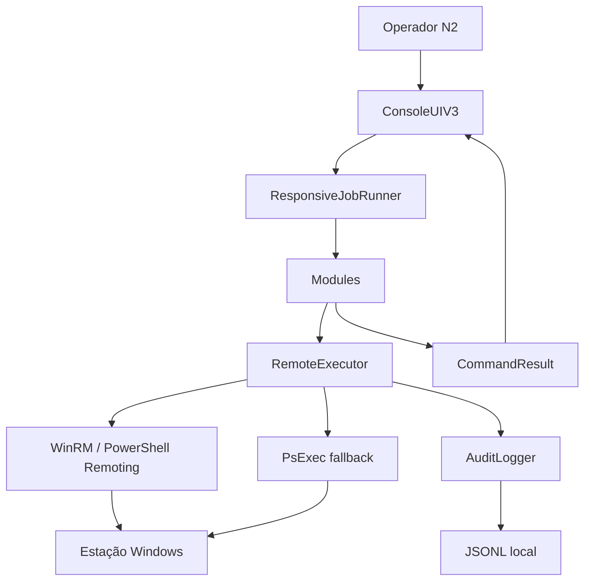
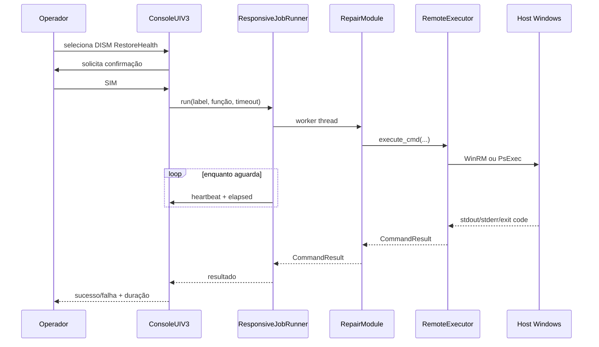

# Arquitetura — Central N2 Workstation v3

## 1. Visão geral

A Central N2 é uma aplicação de console Python para administração, diagnóstico e troubleshooting remoto de estações Windows.

A arquitetura atual evita concentrar interface, regra de negócio e transporte remoto em um único script. O projeto é dividido em quatro camadas principais:

```text
UI / experiência do operador
            ↓
Orquestração / jobs responsivos
            ↓
Módulos de domínio
            ↓
Executor remoto / transportes
            ↓
Estação Windows
```

Essa separação permite substituir interface, adicionar módulos e evoluir transportes sem reescrever toda a aplicação.

---

## 2. Diagrama de componentes



---

## 3. Entry point

O entrypoint atual é:

```text
central_n2/main.py
```

Responsabilidades:

1. validar execução em Windows;
2. validar presença de `config/settings.json`;
3. solicitar elevação administrativa via UAC quando necessário;
4. carregar configuração;
5. instanciar `AuditLogger`;
6. instanciar `RemoteExecutor`;
7. iniciar `ConsoleUIV3`;
8. tratar `KeyboardInterrupt` de forma previsível.

O arquivo não deve receber regras específicas de módulos. Sua função é bootstrap da aplicação.

---

## 4. Camada de interface

Arquivo atual:

```text
ui/console_v3.py
```

A interface é responsável por:

- apresentar menus;
- coletar parâmetros do operador;
- solicitar confirmações;
- acionar módulos;
- mostrar heartbeat de operações longas;
- formatar `CommandResult`;
- manter host selecionado;
- apresentar saúde/compliance;
- encerrar o pool de workers ao sair.

### Regra arquitetural

A UI não deve conter scripts PowerShell extensos nem lógica de infraestrutura. Sempre que uma operação crescer, ela deve ser movida para um módulo.

---

## 5. Runner responsivo

Arquivo:

```text
core/jobs.py
```

Classe:

```python
ResponsiveJobRunner
```

Objetivo: impedir que uma chamada bloqueante faça a aplicação parecer congelada.

### Implementação

- `ThreadPoolExecutor`;
- quatro worker threads;
- prefixo de thread `central-n2`;
- heartbeat configurável;
- tempo medido com `time.monotonic()`;
- timeout calculado com tempo restante real;
- callback opcional `on_tick`;
- cancelamento do `Future` quando possível;
- encerramento com `cancel_futures=True`.

### Por que threads

As principais operações da Central são I/O-bound:

- espera por WinRM;
- espera por PsExec;
- PowerShell remoto;
- chamadas de rede;
- DISM;
- SFC;
- WMI/CIM;
- consulta de Event Log;
- inventários remotos.

A thread principal pode continuar atualizando o console enquanto o worker aguarda o host remoto.

### O que threads não resolvem

`Future.cancel()` só cancela um job que ainda não começou a executar. Se o worker já disparou um processo remoto, o timeout local não é garantia de término do processo remoto.

Exemplo:

```text
Central → WinRM → DISM /RestoreHealth
             ↑
      timeout local
```

O DISM pode continuar executando na estação mesmo depois de a Central abandonar a espera.

Essa limitação deve ser considerada em qualquer futura implementação de cancelamento explícito.

---

## 6. Executor remoto

Arquivo:

```text
core/executor.py
```

O executor centraliza a execução remota e evita que cada módulo implemente sua própria lógica de transporte.

### Estratégia

```text
Ação
 ↓
Verifica WinRM
 ↓
Disponível? ── sim ──> PowerShell Remoting
    │
    não
    ↓
PsExec fallback
```

### Vantagens

- comportamento uniforme;
- timeouts centralizados;
- logging consistente;
- menor duplicação;
- módulos independentes de transporte;
- possibilidade futura de adicionar outro backend sem alterar todos os módulos.

### WinRM preferencial

WinRM é preferido porque fornece um caminho mais estruturado para PowerShell remoto e reduz dependência de parsing de console.

### PsExec fallback

PsExec é mantido para ambientes onde WinRM não esteja disponível ou configurado.

O fallback depende mais fortemente de:

- RPC/SMB;
- políticas de firewall;
- acesso administrativo;
- disponibilidade de compartilhamentos administrativos;
- contexto remoto do processo.

---

## 7. Contrato `CommandResult`

Arquivo:

```text
core/result.py
```

Todo módulo deve retornar `CommandResult` sempre que representar uma operação remota.

Campos relevantes incluem:

- sucesso/falha;
- comando;
- host;
- stdout;
- stderr;
- código de retorno;
- duração;
- transporte;
- `data` estruturado;
- metadata.

### Preferência por dados estruturados

Quando PowerShell puder retornar objetos convertidos para JSON, o módulo deve preferir:

```text
PowerShell object
      ↓
ConvertTo-Json
      ↓
Python dict/list
      ↓
CommandResult.data
```

em vez de parsing de saída textual.

---

## 8. Módulos de domínio

Diretório:

```text
modules/
```

Cada módulo encapsula uma área funcional, por exemplo:

```text
repair.py       → SFC/DISM/CHKDSK/WMI
performance.py  → amostragem de performance
devices.py      → PnP/drivers/USB
security.py     → Defender/Firewall/BitLocker/TPM
network.py      → rede da estação
domain.py       → domínio/GPO
printers.py     → impressão
storage.py      → disco físico/bateria
crashes.py      → BSOD e Application Error
```

### Critério para novo módulo

Criar um novo módulo quando a funcionalidade:

- tiver domínio próprio;
- possuir múltiplas operações relacionadas;
- exigir scripts remotos relevantes;
- precisar de testes específicos;
- tiver política de segurança própria;
- começar a tornar outro módulo excessivamente grande.

---

## 9. Logging e auditoria

Arquivo:

```text
core/logger.py
```

O executor pode registrar ações administrativas em JSONL diário.

Objetivos:

- saber qual ação foi solicitada;
- identificar operador quando disponível;
- registrar host;
- transporte;
- resultado;
- duração;
- erro.

Logs não devem conter credenciais, tokens ou senhas.

---

## 10. Configuração

Arquivo principal:

```text
config/settings.json
```

Configura:

- timeout padrão;
- caminho do PsExec;
- diretório Sysinternals;
- GLPI;
- catálogo de software;
- baseline de compliance;
- heartbeat da UI;
- timeout de operações longas.

A aplicação atualmente carrega esse arquivo diretamente. Não existe ainda um mecanismo nativo de `settings.local.json`/override. Portanto, configurações específicas do ambiente devem ser mantidas com cuidado para não serem publicadas inadvertidamente.

---

## 11. Fluxo de uma operação

Exemplo: `DISM RestoreHealth`.



---

## 12. Performance

### Decisões atuais

- threads para operações remotas I/O-bound;
- limite fixo pequeno de workers para evitar explosão de concorrência;
- coleta de performance feita em uma única execução PowerShell remota;
- JSON para reduzir múltiplas chamadas de ida e volta;
- timeouts explícitos em operações potencialmente longas;
- módulo de lote separado para concorrência entre hosts.

### O que evitar

- criar uma thread por comando sem limite;
- paralelizar SFC/DISM/limpeza na mesma estação;
- executar várias operações de manutenção simultâneas no mesmo host;
- fazer centenas de chamadas WinRM pequenas quando uma única consulta estruturada puder agregar dados;
- polling remoto agressivo abaixo da necessidade operacional.

---

## 13. Tolerância a falhas

A aplicação deve distinguir:

```text
host offline
DNS falhou
WinRM indisponível
fallback falhou
comando retornou erro
timeout local
PowerShell lançou exceção
resultado vazio
```

Esses casos não devem ser apresentados ao operador apenas como “erro genérico”.

---

## 14. Segurança por design

A arquitetura segue alguns controles básicos:

- elevação administrativa explícita;
- nenhuma persistência de senha no código;
- confirmação para ações disruptivas;
- Defender/Firewall sem opção de desativação;
- Sysinternals não baixado automaticamente;
- repositório público sem configuração operacional sensível;
- módulo de rede restrito à estação, sem administração de switches/NAC;
- logging local de ações.

Ver [`security.md`](security.md).

---

## 15. Evolução recomendada

Próximas evoluções arquiteturais que fazem sentido:

1. separar configuração pública de configuração local;
2. criar um `SettingsLoader` com merge de `settings.json` + `settings.local.json`;
3. introduzir IDs de job e cancelamento cooperativo;
4. criar sessão remota reutilizável por host quando isso trouxer benefício mensurável;
5. adicionar camada de correlação de diagnóstico;
6. exportar relatório N2 normalizado;
7. criar interface gráfica sem alterar módulos/executor;
8. adicionar testes de integração em VM Windows controlada.

A regra principal é manter a dependência apontando para baixo:

```text
UI → módulos → executor
```

Nunca:

```text
executor → UI
```
